# 📡 WiFi Auditor

[](https://github.com/pr3y/Bruce) [](https://github.com/pr3y/Bruce) [](https://hashcat.net) [](LICENSE)

A clean, simple toolkit to **test the robustness of your own Wi-Fi**: the
**LilyGO T-Embed CC1101 (Bruce firmware)** captures the WPA/WPA2 handshake, your
**Mac** cracks it on the GPU (hashcat, Metal). Ships with a small local **web UI**.

```
.pcap/.cap  (LilyGO SD)  →  .hc22000  →  hashcat (mode 22000, GPU)  →  password
```

> ## ⚠️ Authorized use only
> This tool is meant **solely** to test the robustness of **your own** Wi-Fi
> network, or networks you have **written permission** to test. Capturing or
> cracking a network you do not own is illegal (France: art. 323-1 ff. of the
> Penal Code). The scripts here **never capture traffic** — they only process
> files you already have.

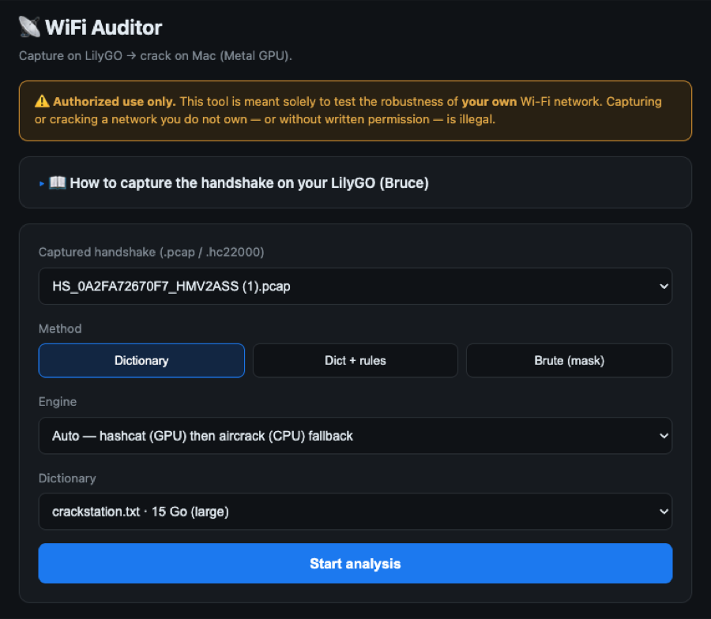

## Why the Mac cracks, not the LilyGO

WPA2 uses PBKDF2 (4096 iterations) **per password guess**.

| Platform | guesses/s (order of magnitude) | 15 GB dict (CrackStation) |
|---|---|---|
| LilyGO (ESP32-S3) | ~20–100 | months ❌ |
| Mac M2 Pro (hashcat Metal) | ~50 000–100 000+ | hours ✅ |

The LilyGO is the **sensor**. Big dictionaries stay on the Mac.

## Install

```bash
python3 auditor.py setup      # installs hcxtools + hashcat via Homebrew
```

## Usage — command line

```bash
# 1) Convert the SD captures to .hc22000 (auto-detects the mounted SD)
python3 auditor.py scan
python3 auditor.py scan /Volumes/LILYGO/BrucePCAP/handshakes   # or a folder

# 2) Crack (auto-detects your wordlists)
python3 auditor.py crack ~/Downloads/hc22000
python3 auditor.py crack ./hc22000 --wordlist ~/Downloads/weakpass_2_wifi.txt
```

## Usage — web UI

```bash
python3 gui_server.py          # then open http://127.0.0.1:8777
```

Or double-click **`WiFi Auditor.command`**. The UI lets you pick the capture,
choose **Dictionary / Dict + rules / Brute (mask)**, and shows live progress
(candidates tested, speed, ETA) plus the final password.

- **Dictionary** — straight wordlist.
- **Dict + rules** — wordlist × hashcat rules (great for human passwords like a
  word + a digit, e.g. `cerises` → `1cerises`).
- **Brute (mask)** — presets per key format (8/10 digits, 8/10/26 hex, …), a free
  editable mask, and a **full brute force** with a selectable length range.
  ⚠️ Full `?a` brute explodes past 8 chars — only useful for short/known formats.

### Engine — CPU vs GPU

An **Engine** selector picks how candidates are tested:

- **aircrack-ng (CPU, all cores)** — **default**. Reads the raw `.pcap` and stops at
  the first match. For **human passwords** (a word + a digit, e.g. `cerises` →
  `1cerises`) it is often **instantaneous**, and it avoids hashcat's WPA quirks
  (short base words dropped before rules; some message-pair conversions it can't
  verify). Needs the original `.pcap` (not a bare `.hc22000`).
- **hashcat (GPU) only** — Metal on Apple Silicon, massively parallel. Best for
  **very large dictionaries / masks** where raw throughput wins.
- **Auto** — hashcat (GPU) first, then aircrack (CPU) as a safety net if hashcat
  finds nothing. Candidates are generated by `hashcat --stdout` (rules/masks) and
  verified by aircrack.

> Rule of thumb: **human/word-based password → aircrack**; **huge brute/dictionary
> → hashcat**. The default is aircrack because most real Wi-Fi passwords are
> word-based.

---

# 📖 Capturing the handshake on the LilyGO (Bruce)

The LilyGO records the WPA handshake; the Mac cracks it. **Requirements:** an SD
card inserted, and a **client (phone/laptop) connected** to the target AP in
**2.4 GHz** (the ESP32 cannot see 5 GHz).

## ✅ Method A — Targeted (recommended)

Pick **one** network and capture only that one — no neighbours disturbed. This is
the cleanest path: it deauths **just your AP** and grabs a coherent M1→M4.

> ⚠️ **Keep your Bruce firmware up to date.** Older builds had a bug where
> "Handshake saved!" was shown but **nothing was written to the SD**. Updating the
> firmware fixes it — the file then lands in `/BrucePCAP/handshakes/`.

1. **WiFi → Wifi Atks**
   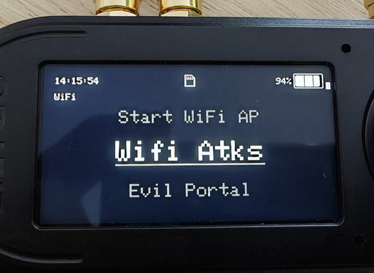
2. **Target Atks** — Bruce scans and lets you pick the target network.
   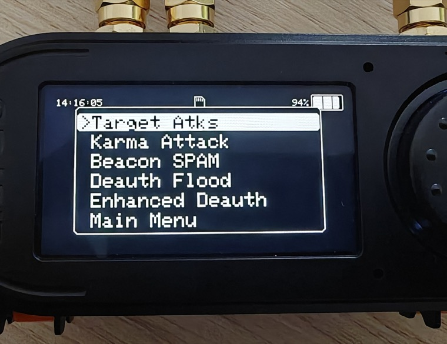
3. Choose your SSID, then **Capture Handshake** (or **Deauth+Clone+Verif** to
   deauth + capture + verify in one go).
   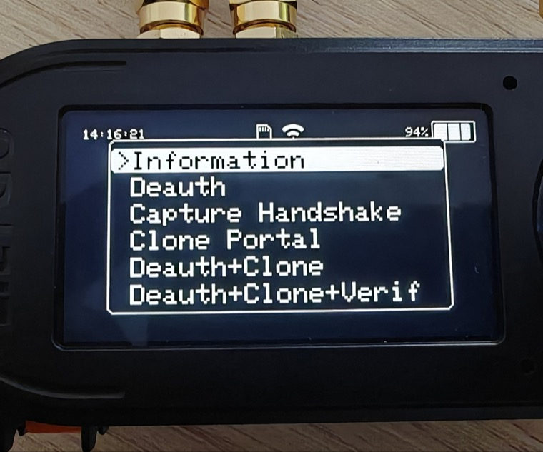
4. It shows the target and **scans**, sending targeted deauths. Watch the four
   **EAPOL MSG 1–4** lines turn from red to green.
   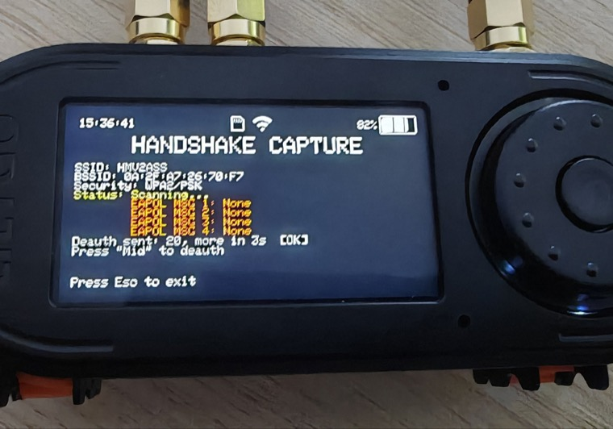
5. When all four are green → **CAPTURED!** and **Handshake saved!** — a clean
   handshake is written to `/BrucePCAP/handshakes/HS_<MAC>_<SSID>.pcap`. Press
   **Esc** to exit, then retrieve the file.
   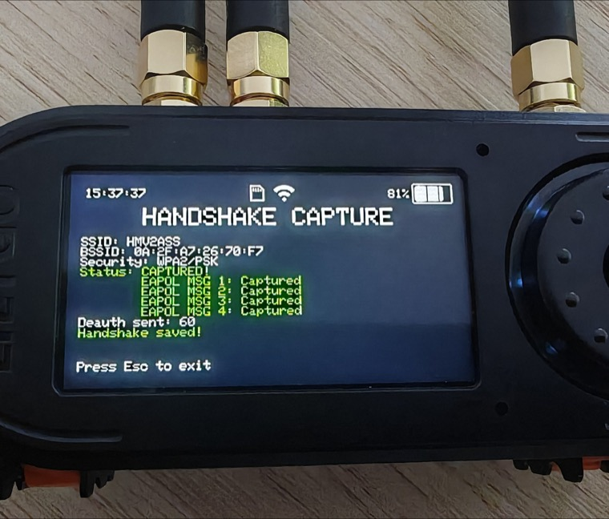

## 🛰️ Method B — PCAP Sniffer (broad, all APs on a channel)

1. **WiFi → Sniffer**
   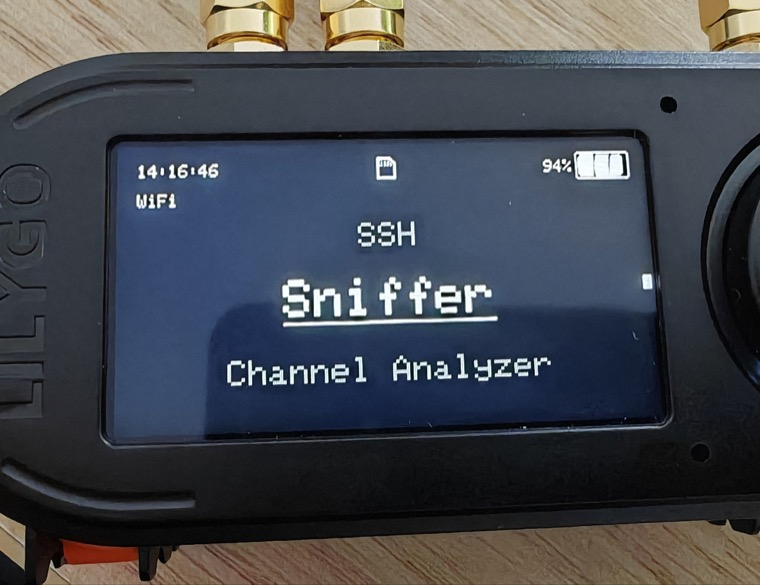
2. The **PCAP SNIFFER** runs. Bottom-left shows the key counter **EAPOL / HS**;
   bottom-right the channel — turn the **wheel / press Next** to lock it on
   **your AP's channel** (stop the hopping).
   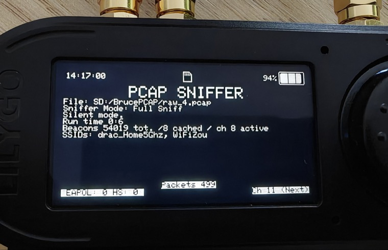
3. Press a button to open the params. Set **Capture Mode → "Only EAPOL/HS"**, and
   toggle **Enable/Disable deauth att** here.
   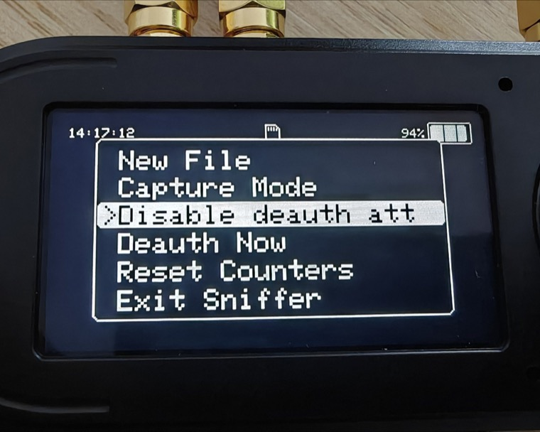
4. Hit **Deauth Now** to force connected clients to reconnect right away.
   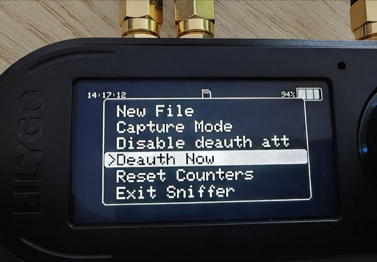

> **Cleaner & kinder to neighbours (Method B):** skip the deauth flood and just
> toggle Wi-Fi off/on **once** on your own phone — only your AP produces a
> handshake, and the capture stays clean (a deauth flood can mix nonces from
> several reconnect attempts and yield an **uncrackable** handshake).

## 🎯 Watch the HS counter, then retrieve

- Ignore the packet count (mostly beacons). Watch **HS** at the bottom-left. When
  it reads **HS: 1**, a complete handshake was saved — you're done.
  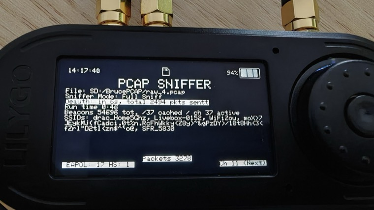
- **Retrieve the .pcap** — pull the SD card into the Mac, or use the Bruce
  **WebUI** to download from `/BrucePCAP/handshakes/`
  (`HS_<MAC>_<SSID>.pcap`).
- **Load it in the app** and start the analysis.

---

## Wordlists

**No dictionaries are bundled** (see [`wordlists/README.md`](wordlists/README.md)).
Drop your own `.txt` in `wordlists/`, `~/Downloads` or `~/Documents` — they are
auto-detected. Recommended: **weakpass_2_wifi**, **CrackStation**, and a
language word list + rules for human passwords.

## Roadmap

- **Phase 1 (this repo)** ✅ — Mac kit: convert + crack + web UI + full capture doc.
- **Phase 2** — Bruce firmware feature (C++): a one-screen "Handshake Grabber"
  (pick AP → interleaved deauth + EAPOL capture, on-device).

## Credits & License

- By **koua29**. Runs on the excellent **[Bruce firmware](https://github.com/pr3y/Bruce)**.
- Cracking by **[hashcat](https://hashcat.net)**, conversion by **[hcxtools](https://github.com/ZerBea/hcxtools)**.
- Code under **[MIT](LICENSE)**. Defensive/authorized use only.
